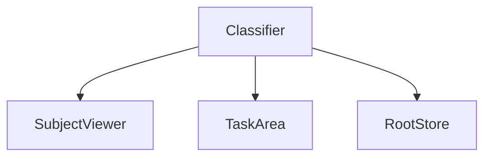
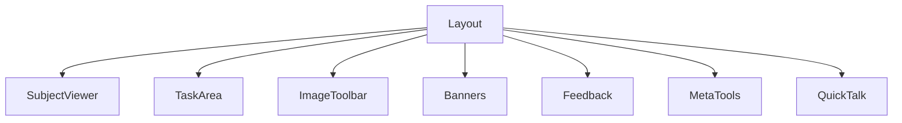

# Zooniverse Classifier

A standalone library for the Zooniverse Project Classifier. The `Classifier` is comprised of three major pieces - the [SubjectViewer](/packages/lib-classifier/src/components/Classifier/components/SubjectViewer/README.md), the [Tasks](/packages/lib-classifier/src/plugins/tasks/README.md), and the [Store](/packages/lib-classifier/src/store/README.md).



- `SubjectViewer` is responsible for subject interaction and display
- `Tasks` are responsible for describing the type of data that the research team collects for a given `subject`.
- `Store` is responsible for managing the application state throughout the classification process.

## Classifier Render Process

The render process starts with a [Layout](/packages/lib-classifier/src/components/Classifier/components/Layout/README.md) that determines which components get loaded. The components that are loaded within the `Layout` but aren't related directly to the `SubjectViewer`, `Tasks`, or `Store` are as follows:

- [Banners](/packages/lib-classifier/src/components/Classifier/components/Banners/README.md)
- Feedback
- [ImageToolbar](/packages/lib-classifier/src/components/Classifier/components/ImageToolbar/README.md)
- MetaTools
- [QuickTalk](/packages/lib-classifier/src/components/Classifier/components/QuickTalk/README.md)



## Classifier Hooks
[Hooks](/packages/lib-classifier/src/hooks/README.md) are a collection of utility functions for the `Classifier`.

## Contributing

### Docker
- `docker-compose up` to run a server on http://localhost:8080 and the storybook on http://localhost:6006.
- `docker-compose down` to stop the container.
- `docker-compose run --rm dev test` to run the tests.

### Node/yarn
```sh
yarn dev
yarn storybook
```

Starts a development server on port 8080 and a Storybook on port 6006 by default.

Use `yarn dev` to run a small development environment app at `localhost:8080`. Specific staging projects and workflows can be loaded by query param `localhost:8080?project=1233&workflow=2367`

To add a local dependency, install it with yarn: `yarn add @zooniverse/package-name@X`. Note the `@X` - without a matching version number, yarn will attempt to find it in the npm registry.

The basic style of the classifier is to be modular. This means that each component should be small and more complex UI should be composed of these smaller components. State that needs to be shared between components or data from asynchronous HTTP requests should be stored in a mobx-state-tree model. Components that need access to this data should be wrapped by a container component that is connected to the stores, then render a child component view. Each component should be unit tested.

d3.js should only be used for the interactive subject viewer visualizations and be wrapped by a container React component. Classifier state including subject and annotation state should not be stored by d3.

## Technologies

  - @zooniverse/grommet-theme - Zooniverse's Grommet theme
  - @zooniverse/panoptes-js - Panoptes API javascript client
  - [Grommet](https://v2.grommet.io/components) - React UI component library
  - [mobx-state-tree](https://github.com/mobxjs/mobx-state-tree/) - App state built on MobX
  - [mobx-react](https://github.com/mobxjs/mobx-react) - Mobx React bindings
  - [d3.js](https://d3js.org/) - For interactive subject viewer visualizations
  - [React.js](https://reactjs.org/)  - Component, virtual DOM based javascript library
  - [styled-components](https://www.styled-components.com/) - CSS in JS styling library.

    Testing uses:

  - [Mocha](https://mochajs.org/) - test runner
  - [Chai](https://www.chaijs.com/) - BDD/TDD assertion library
  - [Sinon](https://sinonjs.org) - test spies, mocks, and stubs
  - [Enzyme](https://airbnb.io/enzyme/) - testing utility for React
