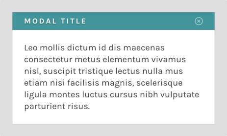

# Modal



A generic modal component. Accepts the following props:

- `active` (boolean) - determines whether the modal is visible or not
- `closeFn` (function) - function called when clicking outside the modal, or when the Esc button is pressed
- `colorTheme` (string) - color theme to use with the modal. Defaults to `light`
- `theme` (object) - Grommet theme to use. Defaults to `@zooniverse/grommet-theme`
- `title` (string) - string to use as the modal title

## Example

```js
<Modal active={isActive} closeFn={setActive} title={title}>
  Leo mollis dictum id dis maecenas consectetur metus elementum vivamus nisl
</Modal>
```

## Notes

This component uses the Grommet `Layer` component, which in turn uses React Portals for rendering. Enzyme doesn't currently support portals, so the modal is wrapped by default in a HOC which provides the Layer, and also exported as a named default for testing.
